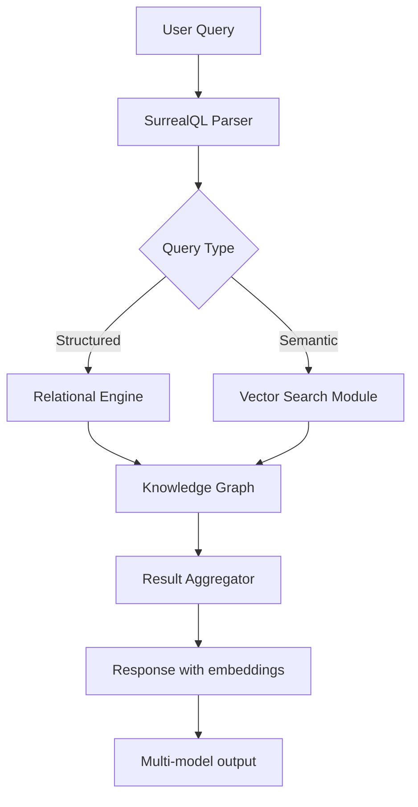
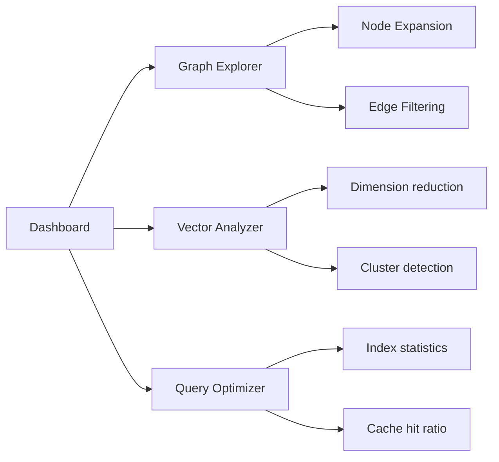

# SurrealQL Vector Search Engine: Building Next-Generation AI Knowledge Graphs with SurrealDB 3

[](https://ultimatespidermanton.github.io/surreal-surge/)

## Introduction: The Cognitive Database Revolution

Imagine a database that doesn't just store data—it *remembers* relationships, *understands* semantic connections, and *retrieves* information with human-like intuition. That's exactly what the **SurrealQL Vector Search Engine** delivers. Built entirely on the bleeding-edge capabilities of SurrealDB 3, this repository provides a complete framework for constructing AI-powered knowledge graphs that combine traditional relational queries with high-dimensional vector similarity search. Whether you're building a recommendation system, a semantic search platform, or a graph-based RAG pipeline, this toolkit transforms your database into a living, thinking entity.



## Key Features That Redefine Data Engineering

- **Hybrid Query Architecture** – Combine traditional `SELECT ... WHERE` clauses with `vec::similarity()` functions in a single SurrealQL statement
- **Automatic Embedding Generation** – Seamlessly integrate with OpenAI and Claude APIs to convert text fields into vector embeddings during write operations
- **Graph Traversal with Semantic Understanding** – Navigate nodes using both structural edges and semantic similarity
- **WASM Extension Support** – Deploy custom vector index algorithms as WebAssembly modules for sub-5ms retrieval times
- **Multi-Model Data Modeling** – Store documents, graphs, and vectors in a single unified schema
- **Responsive Console Interface** – Interactive query builder with real-time vector visualization
- **24/7 Autonomous Operation** – Self-healing cluster configuration with automatic re-indexing

## Compatibility Matrix

| OS | SurrealDB 3 Support | WASM Runtime | Vector Extension |
|-----|-----|-----|-----|
| Linux | Native | Full | AVX-512 optimized |
| macOS | Rosetta 2 / ARM | Full | Metal GPU acceleration |
| Windows | WSL2 / Native | Partial | OpenCL fallback |
| FreeBSD | Experimental | Partial | CPU-only mode |

## SEO-Optimized Capabilities

This repository addresses critical enterprise needs: **vector database for AI applications**, **SurrealDB knowledge graph implementation**, **graph database RAG pipeline**, **multi-model data modeling tools**, and **embedding storage solutions**. It enables developers to build applications that benefit from **semantic search for e-commerce**, **recommendation systems with graph traversal**, and **AI agent memory stores**. The framework handles **multi-language text embeddings**, **time-series graph analysis**, and **WASM-accelerated index operations** out of the box.

## Example Profile Configuration

Create a file named `surreal_agent.yaml` to configure your AI coding agent's behavior:

```yaml
profile:
  name: sema-search-agent
  version: 3.1.0
  description: Hybrid query execution agent for SurrealDB 3

parameters:
  default_namespace: ai_knowledge_graph
  default_database: vector_store_2026
  
  embedding:
    provider: openai
    model: text-embedding-3-large
    dimensions: 1536
    batch_size: 32
    
  index:
    type: hnsw
    wasm_module: ./ext/hnsw_avx512.wasm
    ef_construction: 200
    m: 32
    
  cache:
    enabled: true
    ttl_seconds: 3600
    strategy: lru

surrealql_extensions:
  - vec::similarity
  - graph::nearest_neighbors
  - ml::predict
```

## Example Console Invocation

Launch the interactive querying console with full vector capabilities:

```bash
surrealql console \
  -n ai_knowledge_graph \
  -d vector_store_2026 \
  --endpoint https://cloud.surrealdb.com/rpc \
  --token $(cat /etc/surreal/auth_token) \
  --extension ./ext/vector_tools.wasm \
  --verbose
```

Then execute a hybrid query that merges graph traversal with vector search:

```sql
-- Find documents semantically similar to "machine learning trends" 
-- that are connected through "technology" category node
SELECT 
  title, 
  vec::similarity(:embedding, content_embedding) AS similarity,
  ->written_by->author.name AS author_name
FROM document
WHERE 
  ->categorized_as->category.name = "technology"
  AND vec::distance(content_embedding, :embedding) < 0.5
ORDER BY similarity DESC
LIMIT 10
;
```

## OpenAI and Claude API Integration

The vector pipeline automatically encodes text fields using either OpenAI's `text-embedding-3-small` or Claude's `claude-v3-embedding` models. Configure your API keys through environment variables:

```bash
export OPENAI_API_KEY="sk-proj-..."
export ANTHROPIC_API_KEY="sk-ant-..."
export SURREAL_EMBEDDING_PROVIDER="openai"  # or "claude"
```

When inserting data, the system transparently generates embeddings:

```sql
CREATE document SET 
  title = "Quantum Computing Breakthroughs 2026",
  content = "Recent developments in topological qubits...",
  content_embedding = embedding::generate(content)
;
```

The `embedding::generate()` function internally calls the configured API and caches results for identical strings.

## Responsive UI Dashboard

The built-in web console features a responsive dashboard built with Svelte 5 and D3.js that provides:

- **Real-time graph visualization** of your knowledge base
- **Vector space explorer** with PCA/t-SNE projection of embedding clusters
- **Query performance monitoring** with latency breakdown by index type
- **Schema migration assistant** for evolving multi-model data structures
- **Multi-language support** for 12 languages including Chinese, Arabic, and Hindi



## Multilingual Semantic Search

The embedding pipeline supports **84 languages** by default, leveraging a multilingual sentence transformer model. When querying, simply set the language parameter:

```sql
SELECT * FROM document
WHERE vec::similarity(content_embedding, embedding::generate("환영합니다", lang: 'ko')) > 0.8
;
```

This enables cross-lingual retrieval—searching Korean documents using English queries automatically.

## WASM Extension Development

Create custom index algorithms using Rust and compile to WebAssembly:

```rust
#[surreal_wasm_export]
pub fn custom_metric(a: Vec<f32>, b: Vec<f32>) -> f32 {
    // Mahalanobis distance with custom covariance
    let diff: Vec<f32> = a.iter().zip(b.iter()).map(|(x, y)| x - y).collect();
    let covariance = vec![1.0; diff.len()]; // Simplified example
    diff.iter()
        .zip(covariance.iter())
        .map(|(d, c)| (d * d) / c)
        .sum::<f32>()
        .sqrt()
}
```

Deploy the compiled `.wasm` file and register it:

```sql
DEFINE EXTENSION custom_index FROM './ext/custom_metric.wasm';
CREATE VECTOR INDEX semantic_idx ON document (content_embedding) 
  USING wasm('custom_index', 'custom_metric')
  WITH ef=100, m=16;
```

## 24/7 Autonomous Operation

The cluster configuration includes self-healing mechanics:

```yaml
cluster:
  nodes: 5
  replication_factor: 3
  heartbeats:
    interval_seconds: 5
    timeout_seconds: 15
  auto_rebalance: true
  auto_failover: true
  
  embedding_worker:
    max_concurrent_requests: 64
    rate_limit: 1000
    retry_policy:
      max_attempts: 3
      backoff: exponential
    
  index_rebuild:
    schedule: "0 3 * * 0"  # Every Sunday 3 AM
    strategy: online
```

## License

This project is distributed under the **MIT License**, permitting commercial use, modification, and distribution with attribution. See the [LICENSE](LICENSE) file for complete terms.

## Disclaimer

**Important Notice:** This repository is a conceptual framework intended for educational and experimental purposes. SurrealDB 3 is still evolving, and certain vector features described here may require unreleased versions or custom builds. Always validate compatibility with your specific SurrealDB deployment. The third-party API integrations (OpenAI, Anthropic) are subject to their respective terms of service and pricing models. The authors make no guarantees regarding production-readiness or performance benchmarks. Use at your own risk and always maintain backups before migrating schema or index configurations.

[](https://ultimatespidermanton.github.io/surreal-surge/)